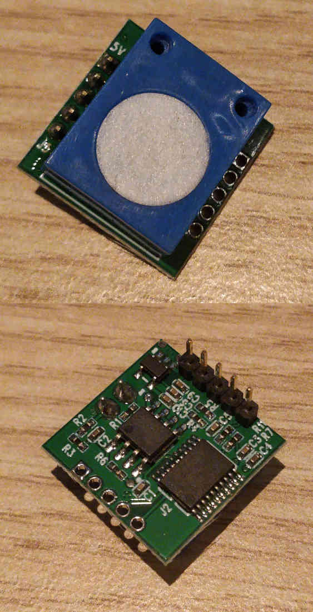

SC01 UART Ozone Sensor
============================

.. seo::
    :description: Instructions for setting up Generic SC01 UART ozone sensors
    :image: sc01_o3.jpg
    :keywords: SC01_O3, Ozone Sensor, UART O3 Sensor

The ``SC01_O3`` sensor platform allows you to use your UART driven ozone sensor with ESPHome.
Several different generic modules are available under different names like SC01_O3 or ZE25-O3.
Compatibility is only guaranteed for the SC01_O3, although it appears that similar modules also use similar firmware.
The sensor is configured in Q&A mode, which means that a measurement result is requested based on a period selected by the user.
:ref:`UART <uart>` is required to be set up in your configuration for this sensor to work.

Please note that the UART configuration must be set at baud_rate 9600 and the stop_bits must be set to 1.

    SC01_O3 UART Ozone Sensor (SC01_O3).

.. code-block:: yaml

    # Example configuration entry
    uart:
      tx_pin: GPIO021
      rx_pin: GPIO016
      baud_rate: 9600
      stop_bits: 1
      id: uart_bus
    sensor:
      - platform: sc01_o3
      id: o3_sensor
      uart_id: uart_bus
      name: "Ozone Concentration"
      icon: "mdi:chemical-weapon"
      update_interval: 5s

Configuration variables:
------------------------

- All options from :ref:`Sensor <config-sensor>`.

- **update_interval** (*Optional*, :ref:`config-time`): The interval to check the
  sensor. Defaults to ``1000ms``.

See Also
--------

- :ref:`sensor-filters`
- :apiref:`sc01_o3/sc01_o3.h`
- `I2C based DFRobot SEN0321 <sen0321.html>`__
- :ghedit:`Edit`
